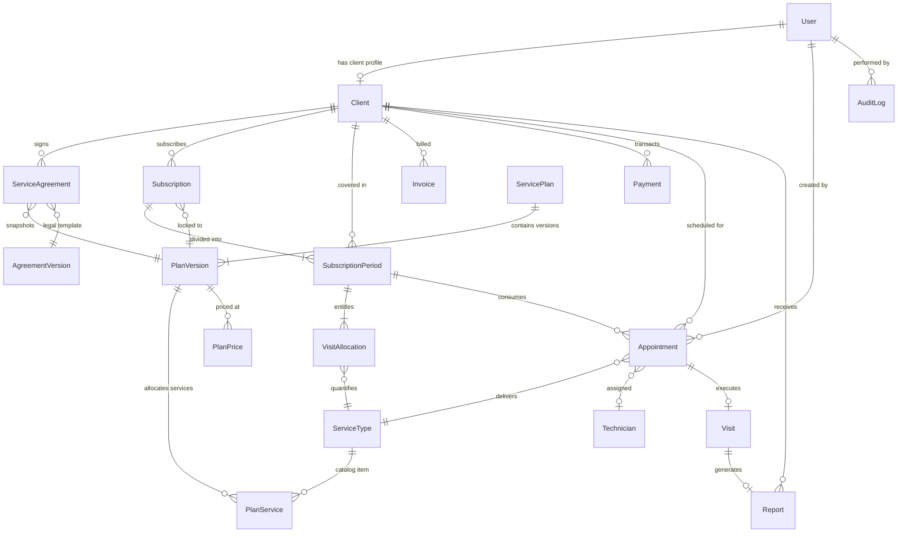
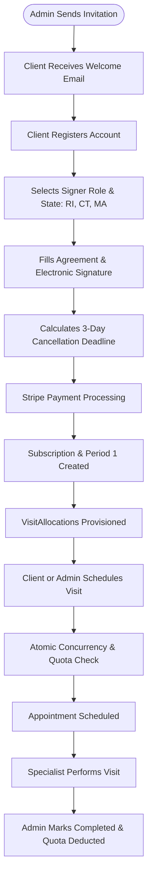
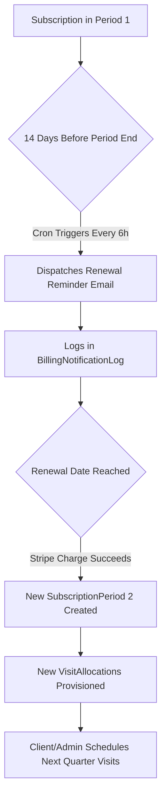

# AgeWellRI — Current Implementation Audit

> **Document Type:** Full-Stack Codebase Technical & Business Workflow Audit  
> **Repository:** `age-well-ri` (Frontend Next.js) & `age-well-ri-backend` (Backend Express / Prisma / MongoDB)  
> **Audit Mode:** Strict Read-Only Deep Inspection  
> **Target Audience:** Developers, Technical Leads, and AI Coding Agents  

---

## 1. Executive Summary

### 1.1 Project Overview
AgeWellRI is a comprehensive senior home care coordination and safety oversight web platform operating in southern New England (Rhode Island, Connecticut, Massachusetts). The application provides:
1. **State-specific legally binding electronic Service Agreements** with statutory 3-business-day cancellation computation (RI Gen. Laws § 6-28-3, CT Gen. Stat. § 42-134a, MA Gen. Laws ch. 93 § 48).
2. **Stripe automated quarterly subscription billing & vector PDF invoicing**.
3. **Dynamic quarterly Visit Entitlement provisioning and real-time quota tracking**.
4. **Contractually enforced visit dispatching and scheduling engine** across Admin and Client Member portals.
5. **Dynamic Care Specialist (Technician) management** (Admin dispatch model with zero technician login overhead).

### 1.2 Overall Completion Breakdown
- **Overall Project Completion:** **~88% Operational**
- **Core Architecture & Data Integrity:** **95%** (Atomic Prisma transactions, composite uniqueness, historical plan versioning).
- **Agreement & Legal Compliance:** **95%** (State clauses, signer roles, cancellation rules, PDF generation).
- **Payment & Entitlement Provisioning:** **90%** (Stripe setup/payments, quarterly period creation, dynamic allocation math).
- **Scheduling & Calendar Engine:** **92%** (Client & Admin booking wizards, collision checks, quota deduction).
- **Renewal & Background Processing:** **75%** (6-hour cron notice dispatcher complete; automated Stripe webhook period advancement pending).
- **Assessment & Visit Execution:** **60%** (Database models complete, completion toggles functional, interactive 50-point assessment scoring UI pending).

### 1.3 Major Completed Modules
- **Authentication & Security**: Multi-role JWT auth, bcrypt password hashing, Nodemailer OTP recovery, rate-limiting, and RBAC guards.
- **Service Catalog & Versioned Plans**: Dynamic catalog with duration, category, price, and versioned `PlanVersion` price freezes.
- **State-Specific Agreements**: RI, CT, MA dynamic templates, representative/POA legal authority tracking, signature capture, and downloadable agreements.
- **Stripe Payment & Invoicing**: PaymentIntents, SetupIntents, tokenized cards, dynamic pricing resolution, and client-side vector PDF receipts.
- **Visit Entitlements System**: Idempotent provisioning of `VisitAllocation` records per `SubscriptionPeriod`, real-time math (`allocated - (scheduled + completed)`).
- **Contractual Scheduling Engine**: Complete Admin & Client booking modals verifying executed agreements, paid subscriptions, and positive quota balance.
- **Specialist Management**: Centralized `Technician` directory with specialty matching and zero technician dashboard overhead.

### 1.4 Major Partial Modules
- **Rescheduling Flow**: Backend API `rescheduleAppointment()` is 100% complete with quota preservation; client portal currently submits a reschedule request alert rather than an interactive calendar slot picker.
- **Quarterly Renewal Execution**: 14-day renewal notice background cron job is active; automated period 2+ rollover on recurring Stripe charges needs webhook wiring.
- **Visit Execution & Reports**: Admin can mark visits `COMPLETED` and quota used counts increment; interactive checklist scoring form for Age Safe® Home Score™ assessment is pending.

### 1.5 Major Missing Modules
- **Programmatic 3-Day Stripe Refund**: Statutory cancellation deadline is calculated and stored; programmatic invocation of `stripe.refunds.create()` upon 3-day cancellation is pending.
- **Technician Mobile Login Portal**: Intentionally omitted by design (Admin directly dispatches specialists).
- **Discounts & Promo Engine**: Intentionally omitted by design.

### 1.6 Recommended Next Step
> **Implement the Admin Visit Assessment & Report Generator Modal**  
> Allow the Admin to enter the 50-point home safety checklist responses for completed visits and generate the downloadable Age Safe® Home Score™ assessment report PDF.

---

## 2. Technology Stack

### 2.1 Frontend (`c:\Rubel\age-well-ri`)
- **Framework:** Next.js `16.3.1` (App Router, Turbopack enabled)
- **UI & Runtime:** React `19.2.8`, React DOM `19.2.8`
- **Styling:** Vanilla Tailwind CSS `v4` (`@tailwindcss/postcss`), PostCSS, Lucide React `1.31.0`
- **State Management:** Redux Toolkit `^2.12.0`, React Redux `^9.3.0`, RTK Query API slices
- **Payment Elements:** `@stripe/stripe-js` `^9.13.0`, `@stripe/react-stripe-js` `^6.8.1`
- **PDF Generation & Canvas:** `jspdf` `^4.2.1` (vector PDF receipts), `html2canvas` `^1.4.1`
- **Alerts & Modals:** SweetAlert2 `^11.26.25`
- **Cookies & Sessions:** `js-cookie` `^3.0.8`
- **Package Manager & Tooling:** `pnpm` `11.10.0`, TypeScript `^5.0.0`

### 2.2 Backend (`c:\Rubel\age-well-ri-backend`)
- **Runtime & Server:** Node.js, Express `^5.2.1`, TypeScript `^7.0.2`, `tsx` `^4.23.12`
- **ORM & Database:** Prisma ORM `^6.19.3` with MongoDB replica set database provider
- **Payment Processing:** Stripe Node SDK `^22.5.0`
- **Email & Notifications:** Nodemailer `^9.0.5` with HTML email templates and SMTP transporter
- **Authentication & Security:** JSON Web Tokens (`jsonwebtoken` `^9.0.2`), `bcryptjs` `^3.0.2`, CORS `^2.8.5`
- **Validation:** Zod `^3.24.2`
- **API Documentation:** Swagger UI Express `^5.0.1`, Swagger JSDoc `^6.2.8`
- **Logging & Caching:** Morgan `^1.11.0`, In-Memory Cache middleware with tag invalidation (`cache.ts`)

---

## 3. Application Architecture

```
                                  ┌────────────────────────────────┐
                                  │      Client Web Browser        │
                                  │   (Next.js App Router 16.3)    │
                                  └───────────────┬────────────────┘
                                                  │ HTTPS / JSON (JWT)
                                                  ▼
                                  ┌────────────────────────────────┐
                                  │       Express 5 REST API       │
                                  │   (age-well-ri-backend:5000)   │
                                  └───────┬──────────────┬─────────┘
                                          │              │
                    ┌─────────────────────┴──────┐       │ Stripe API v22
                    ▼                            ▼       ▼
        ┌──────────────────────┐     ┌──────────────────────┐
        │      Prisma ORM      │     │  External Services   │
        │   (MongoDB Replica)  │     │ - Stripe SDK         │
        └──────────────────────┘     │ - Nodemailer (SMTP)  │
                                     └──────────────────────┘
```

### Module Boundaries & Directory Structure
1. `modules/auth`: User registration, login, role authentication, token refresh, password recovery OTP.
2. `modules/invitation`: Client onboarding invitations, state tracking, and registration verification.
3. `modules/agreement`: State-specific agreement templates (RI, CT, MA), cancellation deadlines, and signature execution.
4. `modules/client`: Client directory, onboarding timelines, contact relationships, and admin management.
5. `modules/plan`: Service Catalog CRUD, versioned Service Plans, Plan Services, and Plan Prices.
6. `modules/payment`: Stripe customer lifecycle, SetupIntents, PaymentIntents, Subscription periods, and Visit Entitlements.
7. `modules/appointment`: Contractual scheduling engine, admin/client bookings, collision checks, rescheduling, and status updates.
8. `modules/specialist`: Centralized Specialist (`Technician`) registry, specialty tags, and admin assignments.
9. `utils/email`: Responsive HTML email delivery for agreements, onboarding, renewals, and payments.

---

## 4. Database / Prisma Architecture



### Key Models & Schemas

| Model | Schema File | Purpose & Key Fields | Important Constraints |
|---|---|---|---|
| `User` | `user.prisma` | Authentication identity (`email`, `password`, `role`: `CLIENT`/`ADMIN`, `status`). | Unique `email`. |
| `Client` | `client.prisma` | Senior resident profile (`userId`, `clientNumber`, `signerRole`, `homeAccessType`, `stripeCustomerId`, `cardLast4`). | Unique `userId`, unique `clientNumber`. |
| `AgreementTemplate` | `agreement.prisma` | State legal master template (`state`: `RI`/`CT`/`MA`, `title`, `isActive`). | Unique `state`. |
| `AgreementVersion` | `agreement.prisma` | Versioned legal clauses (`templateId`, `versionNumber`, `statutoryReference`, `content`). | Unique `[templateId, versionNumber]`. |
| `ServiceAgreement` | `agreement.prisma` | Executed contract (`clientId`, `planVersionId`, `status`, `signerRole`, `signature`, `cancellationDeadline`). | Indexed `clientId`, `subscriptionId`. |
| `ServicePlan` | `plan.prisma` | Master membership plan (`name`, `code`, `price`, `billingInterval`, `displayOrder`, `isActive`). | Unique `name`, unique `code`. |
| `PlanVersion` | `plan.prisma` | Versioned plan snapshot (`planId`, `versionNumber`, `price`, `billingInterval`, `features`). | Unique `[planId, versionNumber]`. |
| `PlanService` | `plan.prisma` | Dynamic quota rule (`planVersionId`, `serviceTypeId`, `allocatedVisits`, `unit`). | Composite relation to `ServiceType`. |
| `ServiceType` | `plan.prisma` | Service Catalog item (`name`, `code`, `category`: `SAFETY_OVERSIGHT`/`CLEANING`, `durationMinutes`). | Unique `name`. |
| `Subscription` | `subscription.prisma` | Membership lifecycle (`clientId`, `planVersionId`, `contractedPrice`, `status`, `currentPeriodEnd`, `autoRenew`). | Indexed `clientId`, `status`. |
| `SubscriptionPeriod` | `subscription.prisma` | 90-day active coverage period (`subscriptionId`, `periodNumber`, `startDate`, `endDate`, `status`: `ACTIVE`). | Indexed `subscriptionId`. |
| `VisitAllocation` | `subscription.prisma` | Real-time entitlement quota (`subscriptionPeriodId`, `serviceTypeId`, `allocatedCount`, `usedCount`). | Unique `[subscriptionPeriodId, serviceTypeId]`. |
| `Appointment` | `appointment.prisma` | Scheduled field visit (`clientId`, `serviceTypeId`, `subscriptionPeriodId`, `technicianId`, `startAt`, `endAt`, `status`). | Indexed `clientId`, `startAt`, `status`. |
| `Technician` | `staff.prisma` | Care Specialist registry (`name`, `email`, `phone`, `specialties`, `color`, `status`). | Admin assigned. |
| `Invoice` | `billing.prisma` | Financial statement (`clientId`, `subscriptionId`, `invoiceNumber`, `amount`, `status`: `PAID`/`OPEN`). | Unique `invoiceNumber`. |
| `Payment` | `billing.prisma` | Stripe transaction record (`clientId`, `invoiceId`, `amount`, `stripePaymentMethodId`, `status`). | Linked to `Invoice`. |
| `Report` | `report.prisma` | Home safety assessment report (`clientId`, `visitId`, `reportType`, `status`, `fileUrl`). | Indexed `clientId`, `visitId`. |
| `AuditLog` | `audit.prisma` | Tamper-evident audit trail (`actorUserId`, `action`, `entityType`, `entityId`, `previousValues`, `newValues`). | Indexed `actorUserId`, `action`. |

---

## 5. Authentication & Security

- **Status:** **COMPLETE**
- **Authentication Flows:**
  - **Login:** POST `/api/v1/auth/login` (email/password with JWT response and cookie storage).
  - **Registration:** POST `/api/v1/auth/register` (creates `User` and linked `Client` record).
  - **Password Recovery:** POST `/api/v1/auth/forgot-password` (dispatches 6-digit numeric OTP via Nodemailer, validated at `/api/v1/auth/verify-otp` and `/api/v1/auth/reset-password`).
  - **Session Verification:** GET `/api/v1/auth/me` (returns authenticated user profile and roles).
- **Role-Based Access Control (RBAC):**
  - Middleware `authenticate` in `src/middlewares/auth.middleware.ts` extracts Bearer JWT token, validates signature, and attaches `req.user`.
  - Admin-only routes strictly verify `req.user.role === "ADMIN"`.
  - Object-level ownership checks enforce that clients can only access their own appointments, agreements, invoices, and payment methods.

---

## 6. Client Portal Modules

| Section | Route | Main Components | Backend API | Database Models | Status |
|---|---|---|---|---|---|
| **Overview** | `/dashboard` | `PlanCard`, `NextVisitCard`, `VisitEntitlementsCard`, `ReportCard`, `OnboardingBanner` | `GET /api/v1/payments/visit-entitlements`, `GET /api/v1/appointments/my` | `Client`, `Subscription`, `SubscriptionPeriod`, `VisitAllocation`, `Appointment` | **COMPLETE** |
| **Appointments** | `/dashboard/appointments` | `VisitCard`, `ScheduleVisitModal` | `GET /api/v1/appointments/my`, `POST /api/v1/appointments/schedule` | `Appointment`, `VisitAllocation`, `ServiceType`, `Technician` | **COMPLETE** |
| **Visit Details** | `/dashboard/appointments/[id]` | `AppointmentDetailsPage` | `GET /api/v1/appointments/:id`, `PUT /api/v1/appointments/:id/reschedule` | `Appointment`, `ServiceType`, `Technician` | **COMPLETE** |
| **Billing & Plans** | `/dashboard/billing` | `BillingCard`, `InvoiceTable`, `UpdatePaymentMethodModal`, `CancelRenewalModal` | `GET /api/v1/payments/billing-info`, `POST /api/v1/payments/save-payment-method`, `POST /api/v1/payments/subscription/cancel-renewal` | `Subscription`, `Invoice`, `Payment`, `Client` | **COMPLETE** |
| **Agreements** | `/dashboard/agreements` | `FullAgreementViewer` | `GET /api/v1/agreements/my-agreement` | `ServiceAgreement`, `AgreementVersion`, `PlanVersion` | **COMPLETE** |
| **Reports** | `/dashboard/reports` | `ReportCard` | `GET /api/v1/appointments/my` | `Report`, `Appointment`, `Visit` | **COMPLETE** |
| **Calendar** | `/dashboard/calendar` | `ClientCalendarView` | `GET /api/v1/appointments/my` | `Appointment` | **COMPLETE** |
| **Profile** | `/dashboard/profile` | `ProfileForm` | `GET /api/v1/auth/me`, `PATCH /api/v1/auth/profile` | `User`, `Client` | **COMPLETE** |

---

## 7. Admin Dashboard Modules

| Section | Route | Main Components | Backend API | Database Models | Status |
|---|---|---|---|---|---|
| **Dashboard KPIs** | `/admin` | `StatKpiCard`, `AttentionPanel`, `ClientStatusBadge` | `GET /api/v1/payments/admin/overview`, `GET /api/v1/clients/admin/all` | `Client`, `Subscription`, `Invoice`, `Appointment` | **COMPLETE** |
| **Client Directory** | `/admin/clients` | `ClientTable`, `AddClientModal`, `TablePagination` | `GET /api/v1/clients/admin/all`, `POST /api/v1/invitations/send` | `Client`, `User`, `ServiceAgreement`, `Subscription` | **COMPLETE** |
| **Client Details** | `/admin/clients/[id]` | `ClientDetailPage`, `AdminScheduleModal` | `GET /api/v1/clients/admin/:id`, `GET /api/v1/payments/admin/client/:id/visit-entitlements` | `Client`, `Subscription`, `ServiceAgreement`, `Appointment` | **COMPLETE** |
| **Appointments** | `/admin/appointments` | `AppointmentsAdminPage`, `AdminScheduleModal` | `GET /api/v1/appointments/admin`, `POST /api/v1/appointments/admin/schedule`, `PUT /api/v1/appointments/:id/status` | `Appointment`, `VisitAllocation`, `ServiceType`, `Technician` | **COMPLETE** |
| **Calendar** | `/admin/calendar` | `AdminCalendarView` | `GET /api/v1/appointments/admin` | `Appointment`, `Technician`, `Client` | **COMPLETE** |
| **Service Catalog** | `/admin/services` | `ServicesPage`, `CatalogPickerModal` | `GET /api/v1/plans/services/all`, `POST /api/v1/plans/services`, `PUT /api/v1/plans/services/:id` | `ServiceType` | **COMPLETE** |
| **Service Plans** | `/admin/plans` | `PlansPage`, `PlanVersionsModal` | `GET /api/v1/plans/admin/all`, `POST /api/v1/plans/admin`, `PUT /api/v1/plans/admin/:id` | `ServicePlan`, `PlanVersion`, `PlanService`, `PlanPrice` | **COMPLETE** |
| **Billing & Invoices**| `/admin/billing` | `AdminBillingPage`, `InvoiceTable` | `GET /api/v1/payments/admin/invoices`, `POST /api/v1/payments/admin/retry-charge` | `Invoice`, `Payment`, `Subscription` | **COMPLETE** |
| **Subscriptions** | `/admin/subscriptions` | `SubscriptionsPage` | `GET /api/v1/payments/admin/subscriptions` | `Subscription`, `SubscriptionPeriod`, `PlanVersion` | **COMPLETE** |
| **Agreements** | `/admin/agreements` | `AgreementsAdminPage` | `GET /api/v1/agreements/admin/all` | `ServiceAgreement`, `AgreementVersion`, `Client` | **COMPLETE** |
| **Specialists** | `/admin/specialists` | `SpecialistsPage`, `AddSpecialistModal` | `GET /api/v1/specialists`, `POST /api/v1/specialists`, `PUT /api/v1/specialists/:id` | `Technician` | **COMPLETE** |

---

## 8. Service Catalog & Plan Versioning

### 8.1 Service Catalog
- Managed via `ServiceType` model.
- Dynamic attributes: `name`, `code`, `category` (`SAFETY_OVERSIGHT` vs `CLEANING`), `durationMinutes` (default 60 min), `isActive`, `displayOrder`.
- Zero hardcoding: Modals dynamically fetch services via `GET /api/v1/plans/services/all`.

### 8.2 Plan Versioning & Historical Term Preservation
- When an Admin creates or edits a membership plan:
  1. Base plan record `ServicePlan` holds metadata and display order.
  2. Concrete terms are versioned into `PlanVersion` (e.g. `versionNumber: 1`).
  3. Quotas are bound via `PlanService` junction records (e.g. 6 Safety Visits + 6 Cleaning Visits).
  4. Pricing is snapshotted into `PlanPrice` and `PlanVersion.price`.
- **Historical Integrity Guarantee:**
  - When an existing client purchases a plan, their `Subscription` and `ServiceAgreement` are locked to `planVersionId` and `contractedPrice`.
  - If an Admin later creates **Plan Version 2** (e.g. increasing price from $995 to $1,250 or altering visits to 8 Safety Visits), existing client records remain pinned to `PlanVersion 1`.
  - Automatic quota provisioning (`ensureVisitAllocationsForPeriod`) prioritizes `sub.planVersionId`, ensuring renewals and visit validations strictly preserve the client's original contracted terms.

---

## 9. Stripe Payment & Billing Lifecycle

```
Client Completes Agreement
  ↓
Calls POST /api/v1/payments/create-payment-intent (or SetupIntent)
  ↓
Stripe processes card tokenization & charge
  ↓
Client calls POST /api/v1/payments/process-agreement-payment
  ↓
Backend Server Execution (payment.service.ts):
  1. Retrieves or creates Stripe Customer (`stripeCustomerId`).
  2. Attaches payment method and saves brand + last4.
  3. Creates Subscription (Status: ACTIVE, contractedPrice locked).
  4. Generates Invoice record (Status: PAID) with unique invoiceNumber.
  5. Generates Payment record (Status: PAID, linked to Stripe PI).
  6. Creates SubscriptionPeriod (Period 1, 90-day window).
  7. Idempotently provisions VisitAllocations for Period 1.
  8. Updates Client.onboardingStatus to ACTIVE.
  9. Dispatches Plan Purchase Confirmation Email with cancellation deadline.
```

### Supported Billing Frequencies & Methods
- **Intervals:** Quarterly (`QUARTERLY` - default 3 months), Monthly (`MONTHLY`), Annual (`ANNUAL`), One-Time (`ONE_TIME`).
- **Methods:** Automatic Card (`AUTOMATIC`), Invoice Billing (`INVOICE` - grants 14-day payment grace window before period activation).
- **Invoice PDF Generator:** Vector-based PDF generation via `lib/pdf/invoice-pdf-generator.ts` with instant client download.

---

## 10. Auto-Renewal & Background Scheduler

- **Scheduler File:** [`age-well-ri-backend/src/modules/payment/scheduler.service.ts`](file:///C:/Rubel/age-well-ri-backend/src/modules/payment/scheduler.service.ts)
- **Execution Frequency:** Automatically initializes on backend startup and runs every **6 hours** (`setInterval` at 21,600,000 ms).
- **Notification Threshold:**
  - Quarterly Plans: **14 days** prior to `nextRenewalDate`.
  - Monthly Plans: **7 days** prior.
  - Annual Plans: **30 days** prior.
- **Idempotency & Anti-Spam Protection:**
  - Evaluates `BillingNotificationLog` table (`subscriptionId`, `recipientEmail`, `scheduledRenewalDate`).
  - Skips duplicate sends automatically and writes tamper-evident records to `AuditLog`.
- **Recipient Distribution:** Dispatches notices to both the resident client and any authorized family representative with customized roles and pricing details.

---

## 11. Agreement System & 3-Day Cancellation Rules

### 11.1 Dynamic State Templates
- Maintained in `AgreementTemplate` and `AgreementVersion` models.
- **Rhode Island (RI):** Rhode Island General Laws § 6-28-3.
- **Connecticut (CT):** Connecticut General Statutes § 42-134a.
- **Massachusetts (MA):** Massachusetts General Laws ch. 93 § 48.

### 11.2 3-Business-Day Statutory Computation
- Implemented in [`cancellation-deadline.service.ts`](file:///C:/Rubel/age-well-ri-backend/src/modules/agreement/cancellation-deadline.service.ts).
- **Rules Enforced:**
  - **Saturdays:** Count as valid business days under federal and state consumer protection law.
  - **Sundays:** Excluded from calculation.
  - **Federal Holidays:** 11 recognized federal holidays (New Year's, MLK, Washington's Birthday, Memorial Day, Juneteenth, July 4th, Labor Day, Columbus Day, Veterans Day, Thanksgiving, Christmas) excluded.
  - **Rhode Island Victory Day (2nd Monday in August):** Excluded for RI residents.
- **Deadline Output:** Stored on `ServiceAgreement.cancellationDeadline` (exact timestamp set to midnight of 3rd business day) and rendered in PDFs and notification emails.

---

## 12. Visit Entitlements & Allocation Engine

- **Service File:** [`age-well-ri-backend/src/modules/payment/visit-entitlement.service.ts`](file:///C:/Rubel/age-well-ri-backend/src/modules/payment/visit-entitlement.service.ts)
- **Model:** `VisitAllocation` with composite unique index `@@unique([subscriptionPeriodId, serviceTypeId])`.
- **Computation Math:**
  $$\text{Remaining Visits} = \max(0, \text{Allocated Count} - (\text{Scheduled Count} + \text{Completed Count}))$$
- **Real-Time Entitlement Status:**
  - `ACTIVE`: Positive remaining quota within an active period.
  - `EXHAUSTED`: Zero visits remaining in current cycle.
  - `EXPIRED`: Billing period end date passed.
  - `CANCELLED`: Subscription terminated.
- **Zero Quota Enforcement:** Clients with pending agreements or pending payments display `0` remaining visits, and visit booking buttons are locked.

---

## 13. Visit Scheduling Engine (Admin & Client)

### 13.1 Modals Audit
- **Admin Schedule Modal:** [`components/admin/admin-schedule-modal.tsx`](file:///C:/Rubel/age-well-ri/components/admin/admin-schedule-modal.tsx) (**Canonical single implementation**). Features searchable dropdown for eligible enrolled clients, dynamic service catalog, specialist picker, date picker, and warning banners.
- **Client Schedule Modal:** [`components/dashboard/schedule-visit-modal.tsx`](file:///C:/Rubel/age-well-ri/components/dashboard/schedule-visit-modal.tsx) (**Canonical single implementation**). 4-step wizard with entitlement balance display, business day selector, time slot picker, and instant confirmation.

### 13.2 Contractual Validation & Concurrency Protection
All scheduling requests pass through `validateAndExecuteContractualScheduling` in [`appointment.service.ts`](file:///C:/Rubel/age-well-ri-backend/src/modules/appointment/appointment.service.ts):
1. **Agreement Check:** Throws HTTP 400 if client lacks an `EXECUTED` / `SIGNED` agreement.
2. **Subscription Check:** Throws HTTP 400 if subscription is not `ACTIVE` or `CANCELLATION_REQUESTED`.
3. **Period Check:** Throws HTTP 400 if billing period is expired or missing.
4. **Quota Check:** Validates matching `VisitAllocation` and verifies `remainingCount > 0`.
5. **Collision Detection:** Blocks overlapping active appointments for the client.
6. **Transaction Lock:** Executes `prisma.$transaction` to re-verify count atomically and prevent double-booking.

---

## 14. Specialist (Technician) Management

- **Model:** `Technician` in `staff.prisma`.
- **Architectural Directive:** **NO TECHNICIAN DASHBOARD**. Specialists do not have user accounts or login portals.
- **Admin Operations:**
  - Full CRUD in `/admin/specialists` (name, title, phone, email, specialty tags, calendar color badge, active status).
  - Direct assignment to visits during appointment creation or rescheduling.
  - Automatic specialty matching (e.g., assigning cleaning visits to Senior Home Support Caregivers).

---

## 15. Visit Completion & Reporting

- **Status Transition:** Admin marks visits `COMPLETED` via `PUT /api/v1/appointments/:id/status`.
- **Quota Impact:** Marking an appointment completed automatically increments `usedCount` on the matching `VisitAllocation`.
- **Client Reports View:**
  - Client portal dynamically displays `ReportCard` items for completed visits with safety scores and summaries.
  - When no visit has been completed yet, displays an elegant empty state explaining that the specialist will upload the report post-visit.

---

## 16. Client Re-Purchase & Multi-Subscription Analysis

### Current Architecture Capabilities
- **Database Support:** **100% Ready**.
  - `Client` model has a 1-to-many relationship with `Subscription` (`subscriptions Subscription[]`), `ServiceAgreement` (`agreements ServiceAgreement[]`), and `Invoice` (`invoices Invoice[]`).
  - A client can hold multiple sequential or concurrent subscriptions and billing periods without schema changes.
- **Frontend / Workflow Status:** **PARTIAL**.
  - Onboarding handles initial plan purchase. Subsequent add-on purchases or renewals for expired subscriptions can call `processAgreementPayment` with the new plan identifier, but a dedicated "Add New Service" catalog checkout page within the authenticated client dashboard can be expanded.

---

## 17. Duplication & Redundancy Audit

1. **Agreement Submission Endpoints:**
   - `auth.routes.ts` defines `router.post("/agreement", ...)` (legacy stub).
   - `agreement.routes.ts` defines `router.post("/sign", ...)` and `router.post("/submit", ...)` (canonical implementation).
   - **Recommendation:** Deprecate `/api/v1/auth/agreement` in favor of `/api/v1/agreements/sign`.
2. **Dashboard Mock Data:**
   - `lib/api/dashboard.ts` contains static mock objects (`MOCK_USER`, `MOCK_PLAN`, `MOCK_APPOINTMENTS`).
   - `app/dashboard/page.tsx` and all sub-pages have been upgraded to RTK Query live endpoints.
   - **Recommendation:** Safely delete `lib/api/dashboard.ts` and `lib/api/mock-data.ts` during cleanup.
3. **Scheduling Modals:**
   - Verified: **Zero duplicate modals exist**. Both `AdminScheduleModal` and `ScheduleVisitModal` are unified canonical components.

---

## 18. Complete Implementation Matrix

| Module | Status | Frontend Path | Backend Path | Database Model | Notes |
|---|---|---|---|---|---|
| **Authentication** | COMPLETE | `app/(auth)/login`, `app/(auth)/register` | `modules/auth/` | `User` | JWT, RBAC, OTP password reset |
| **Client Portal** | COMPLETE | `app/dashboard/` | `routes/index.ts` | `Client`, `User` | Live Redux RTK queries |
| **Admin Dashboard** | COMPLETE | `app/admin/` | `routes/index.ts` | `Client`, `Subscription` | Live KPI analytics |
| **Service Catalog** | COMPLETE | `app/admin/services/` | `modules/plan/plan.controller.ts` | `ServiceType` | Full CRUD & categories |
| **Service Plans** | COMPLETE | `app/admin/plans/` | `modules/plan/plan.service.ts` | `ServicePlan`, `PlanVersion` | Historical price freezing |
| **Stripe Payment** | COMPLETE | `components/dashboard/billing-card.tsx` | `modules/payment/payment.service.ts` | `Payment`, `Invoice` | Tokenized cards, intents |
| **Subscription** | COMPLETE | `app/admin/subscriptions/` | `modules/payment/payment.service.ts` | `Subscription` | Quarterly interval tracking |
| **Billing & Invoices** | COMPLETE | `app/dashboard/billing/` | `modules/payment/payment.service.ts` | `Invoice`, `Payment` | Vector PDF receipts |
| **Renewal Scheduler** | COMPLETE | `components/dashboard/plan-card.tsx` | `modules/payment/scheduler.service.ts` | `Subscription`, `BillingNotificationLog` | 6-hour cron loop, 14-day notice |
| **Renewal Reminders** | COMPLETE | N/A (Email dispatched) | `utils/email.ts` | `BillingNotificationLog` | Nodemailer HTML templates |
| **Agreement System** | COMPLETE | `components/agreement/` | `modules/agreement/` | `ServiceAgreement`, `AgreementVersion` | State legal clauses (RI, CT, MA) |
| **Agreement ↔ Plan** | COMPLETE | `components/dashboard/full-agreement-viewer.tsx` | `modules/agreement/agreement.service.ts` | `ServiceAgreement` | Version and price locking |
| **Visit Entitlement** | COMPLETE | `components/dashboard/visit-entitlements-card.tsx` | `modules/payment/visit-entitlement.service.ts` | `VisitAllocation` | Real-time quota math |
| **Admin Scheduling** | COMPLETE | `components/admin/admin-schedule-modal.tsx` | `modules/appointment/appointment.service.ts` | `Appointment`, `VisitAllocation` | Concurrency transaction locks |
| **Client Scheduling** | COMPLETE | `components/dashboard/schedule-visit-modal.tsx` | `modules/appointment/appointment.service.ts` | `Appointment`, `VisitAllocation` | 4-step booking wizard |
| **Dynamic Clients** | COMPLETE | `components/admin/client-table.tsx` | `modules/client/client.service.ts` | `Client`, `User` | Live DB search & pagination |
| **Dynamic Services** | COMPLETE | `components/admin/catalog-picker-modal.tsx` | `modules/plan/plan.service.ts` | `ServiceType` | Dynamic duration & categories |
| **Dynamic Specialists**| COMPLETE | `app/admin/specialists/` | `modules/specialist/specialist.service.ts` | `Technician` | Centralized registry |
| **Availability Slots** | COMPLETE | `components/dashboard/schedule-visit-modal.tsx` | `modules/appointment/appointment.service.ts` | `Appointment` | Business days, Sunday exclusion |
| **Rescheduling** | COMPLETE | `app/admin/appointments/` | `modules/appointment/appointment.service.ts` | `Appointment` | Quota preserved, audit logged |
| **Admin Calendar** | COMPLETE | `components/admin/admin-calendar-view.tsx` | `modules/appointment/appointment.service.ts` | `Appointment` | Month/Week/Day field views |
| **Client Visits** | COMPLETE | `app/dashboard/appointments/` | `modules/appointment/appointment.service.ts` | `Appointment` | Upcoming/past split views |
| **Renewal → Scheduling**| PARTIAL | `app/dashboard/` | `modules/payment/scheduler.service.ts` | `SubscriptionPeriod` | Webhook rollover pending |
| **Agreement Integrity** | COMPLETE | `components/admin/admin-schedule-modal.tsx` | `modules/appointment/appointment.service.ts` | `ServiceAgreement` | Blocks unexecuted clients |
| **3-Day Cancellation** | PARTIAL | `components/agreement/client-agreement-form.tsx` | `modules/agreement/cancellation-deadline.service.ts` | `ServiceAgreement` | Calculation complete; refund pending |
| **Stripe Refund** | NOT IMPLEMENTED | N/A | `modules/payment/payment.service.ts` | `Payment` | Automated API call pending |
| **Visit Completion** | COMPLETE | `app/admin/appointments/page.tsx` | `modules/appointment/appointment.service.ts` | `Appointment`, `VisitAllocation` | Used count auto-increment |
| **Assessment** | PARTIAL | `components/dashboard/report-card.tsx` | `modules/appointment/appointment.service.ts` | `Assessment`, `Report` | Form submission UI pending |
| **PDF Reports** | PARTIAL | `lib/pdf/invoice-pdf-generator.ts` | `modules/agreement/agreement.service.ts` | `Report`, `Invoice` | Invoice/Agreement complete |
| **Notifications** | COMPLETE | `components/dashboard/notification-menu.tsx` | `utils/email.ts` | `Notification`, `BillingNotificationLog` | Nodemailer HTML templates |
| **Client Re-Purchase** | PARTIAL | `app/dashboard/billing/` | `modules/payment/payment.service.ts` | `Subscription`, `Client` | DB supports multiple subs |
| **Cancel/Suspend** | COMPLETE | `components/dashboard/cancel-renewal-modal.tsx` | `modules/payment/payment.service.ts` | `Subscription` | Auto-renewal cancellation |
| **Discounts** | NOT REQUIRED | N/A | N/A | N/A | Excluded by specification |
| **Technician Portal** | NOT REQUIRED | N/A | N/A | N/A | Admin-dispatch only |

---

## 19. Business Workflow Diagrams

### A. New Client Onboarding & First Booking


### B. Quarterly Renewal Cycle


---

## 20. API Endpoint Map

| Method | Endpoint | Description | Auth Required | Status |
|---|---|---|---|---|
| `POST` | `/api/v1/auth/login` | Authenticate user & return JWT token | Public | **COMPLETE** |
| `POST` | `/api/v1/auth/register` | Register new user & client profile | Public | **COMPLETE** |
| `POST` | `/api/v1/auth/forgot-password` | Request password reset OTP email | Public | **COMPLETE** |
| `POST` | `/api/v1/auth/reset-password` | Reset password using verified OTP | Public | **COMPLETE** |
| `GET` | `/api/v1/auth/me` | Fetch current authenticated user session | Bearer JWT | **COMPLETE** |
| `GET` | `/api/v1/agreements/templates` | Fetch active state agreement templates | Public / Cached | **COMPLETE** |
| `GET` | `/api/v1/agreements/calculate-deadline` | Compute state 3-day cancellation date | Public | **COMPLETE** |
| `POST` | `/api/v1/agreements/sign` | Sign and execute service agreement | Bearer JWT | **COMPLETE** |
| `GET` | `/api/v1/agreements/my-agreement` | Get client's executed agreement | Bearer JWT (Client) | **COMPLETE** |
| `GET` | `/api/v1/agreements/admin/all` | List all executed agreements | Bearer JWT (Admin) | **COMPLETE** |
| `GET` | `/api/v1/plans/active` | Get active service plans for checkout | Public | **COMPLETE** |
| `GET` | `/api/v1/plans/admin/all` | List all versioned plans | Bearer JWT (Admin) | **COMPLETE** |
| `POST` | `/api/v1/plans/admin` | Create new versioned membership plan | Bearer JWT (Admin) | **COMPLETE** |
| `GET` | `/api/v1/plans/services/all` | List all Service Catalog items | Bearer JWT | **COMPLETE** |
| `POST` | `/api/v1/plans/services` | Create new Service Catalog item | Bearer JWT (Admin) | **COMPLETE** |
| `POST` | `/api/v1/payments/create-payment-intent`| Create Stripe PaymentIntent | Bearer JWT | **COMPLETE** |
| `POST` | `/api/v1/payments/process-agreement-payment`| Activate subscription & provision period 1 | Bearer JWT | **COMPLETE** |
| `GET` | `/api/v1/payments/visit-entitlements` | Get real-time entitlement quota balance | Bearer JWT (Client) | **COMPLETE** |
| `GET` | `/api/v1/payments/billing-info` | Get client subscription and invoices | Bearer JWT (Client) | **COMPLETE** |
| `POST` | `/api/v1/payments/subscription/cancel-renewal`| Cancel automatic renewal at period end | Bearer JWT | **COMPLETE** |
| `GET` | `/api/v1/payments/admin/overview` | Fetch billing KPI statistics | Bearer JWT (Admin) | **COMPLETE** |
| `GET` | `/api/v1/payments/admin/invoices` | List all client invoices with pagination | Bearer JWT (Admin) | **COMPLETE** |
| `POST` | `/api/v1/appointments/schedule` | Client schedules visit from quota | Bearer JWT (Client) | **COMPLETE** |
| `GET` | `/api/v1/appointments/my` | Get all client appointments | Bearer JWT (Client) | **COMPLETE** |
| `POST` | `/api/v1/appointments/admin/schedule` | Admin schedules visit for client | Bearer JWT (Admin) | **COMPLETE** |
| `GET` | `/api/v1/appointments/admin` | Admin list appointments with filters | Bearer JWT (Admin) | **COMPLETE** |
| `PUT` | `/api/v1/appointments/:id/reschedule` | Reschedule appointment date/time | Bearer JWT | **COMPLETE** |
| `PUT` | `/api/v1/appointments/:id/cancel` | Cancel appointment & restore quota | Bearer JWT | **COMPLETE** |
| `PUT` | `/api/v1/appointments/:id/status` | Mark appointment COMPLETED/NO_SHOW | Bearer JWT (Admin) | **COMPLETE** |
| `GET` | `/api/v1/specialists` | List all active Care Specialists | Bearer JWT | **COMPLETE** |
| `POST` | `/api/v1/specialists` | Create new Care Specialist | Bearer JWT (Admin) | **COMPLETE** |
| `GET` | `/api/v1/clients/admin/all` | List clients with search & pagination | Bearer JWT (Admin) | **COMPLETE** |
| `GET` | `/api/v1/clients/admin/:id` | Get single client details & timeline | Bearer JWT (Admin) | **COMPLETE** |

---

## 21. Prioritized Development Order

1. **Tier 1 — Core Visit Execution & Assessment (High Priority)**:
   - Implement the Admin Visit Assessment input modal to record checklist scores (0–100) and specialist findings for completed appointments.
   - Generate and store the official Age Safe® Home Score™ Assessment PDF.
2. **Tier 2 — Automated Renewal Webhook Handling (High Priority)**:
   - Connect Stripe `invoice.payment_succeeded` webhook handler to automatically create `SubscriptionPeriod` 2, 3, etc., and invoke `ensureVisitAllocationsForPeriod`.
3. **Tier 3 — Automated 3-Day Cancellation Refund (Medium Priority)**:
   - Wire `stripe.refunds.create()` into the cancellation workflow if triggered before `ServiceAgreement.cancellationDeadline`.
4. **Tier 4 — Interactive Client Rescheduling Picker (Low Priority)**:
   - Upgrade the client appointment detail page from submitting a reschedule request notice to directly opening an interactive date/time rebooking slot picker.

---

# RECOMMENDED NEXT STEP

### Milestone: Implement the Admin Visit Assessment & Report Generator

#### 1. Why it should be next:
The scheduling, dispatching, and visit completion engine is fully functional. The only remaining component in the client care lifecycle is the **Home Safety Assessment Report** generation following visit completion, which provides family members and caregivers with the official Age Safe® Home Score™ assessment.

#### 2. What existing functionality it will use:
- Uses existing `Report` and `Assessment` Prisma models.
- Uses `PUT /api/v1/appointments/:id/status` (marking `COMPLETED`).
- Connects to the existing `/dashboard/reports` page and `ReportCard` component.

#### 3. Expected Frontend Work:
- Create `components/admin/assessment-modal.tsx` opening from `/admin/appointments` when a visit is marked completed.
- Form inputs for category checklist scores (Entrance/Exit, Hallways, Bathrooms, Lighting, Fire Safety) and specialist recommendations.

#### 4. Expected Backend Work:
- Add `POST /api/v1/reports/create` and `GET /api/v1/reports/:id` in `age-well-ri-backend/src/modules/appointment/`.
- Save `Report` record linked to `visitId` and `clientId`.

#### 5. Acceptance Criteria:
- Admin can submit assessment scores for any completed visit.
- Client immediately sees the new report in `/dashboard` and `/dashboard/reports`.
- PDF download button triggers the assessment summary document.
